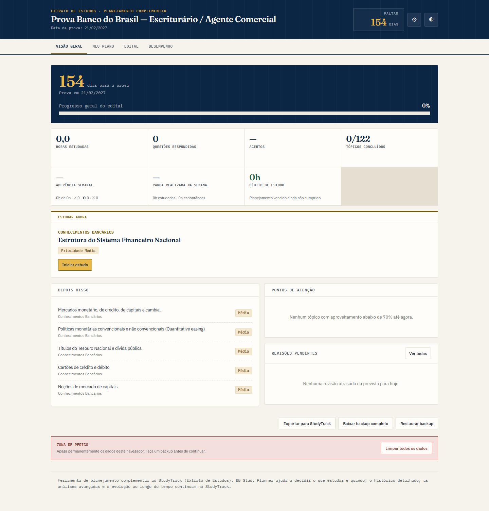
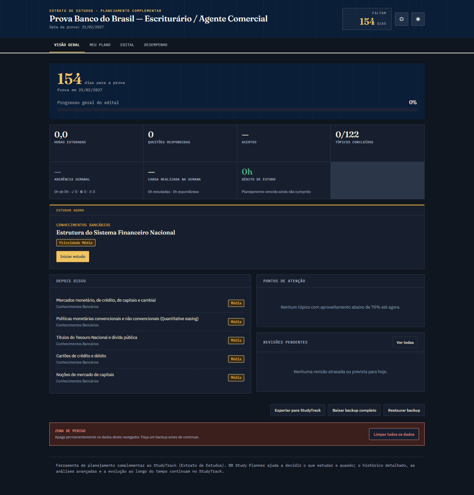

# PlannerBB

Planejador adaptativo para o concurso do Banco do Brasil, pensado para operar ao
lado do StudyTrack. O PlannerBB transforma disponibilidade, prioridades, revisões
e débito de estudo em um plano executável, mantendo o histórico das decisões.

## Principais recursos

- planejamento diário e semanal com capacidade configurável;
- aderência por assignment, carga realizada e débito de estudo;
- replanejamento explicável, sem apagar atividades anteriores;
- repetição espaçada com limite diário reservado para revisões;
- análise de viabilidade com buffer e sugestões de ajuste calculadas;
- temas claro e escuro alinhados ao design system do StudyTrack;
- backup integral e intercâmbio JSON versionado (`schemaVersion: 5`).

## Executar e validar

Abra `index.html` em um navegador moderno. Para executar a suíte:

```powershell
npm test
```

Os testes cobrem o motor de planejamento, persistência, exportação, aceitação e
presets de estresse equilibrado, irregular, crítico e de longo prazo.

## Integração com StudyTrack

O contrato está documentado em [export-schema.md](export-schema.md). A exportação
inclui sessões, assignments, resumo do planejamento, estados de revisão e histórico
de replanejamentos. A compatibilidade nativa depende de validação ou mapeamento pelo
StudyTrack; o PlannerBB não presume um contrato oficial que ainda não foi fornecido.

## Capturas




